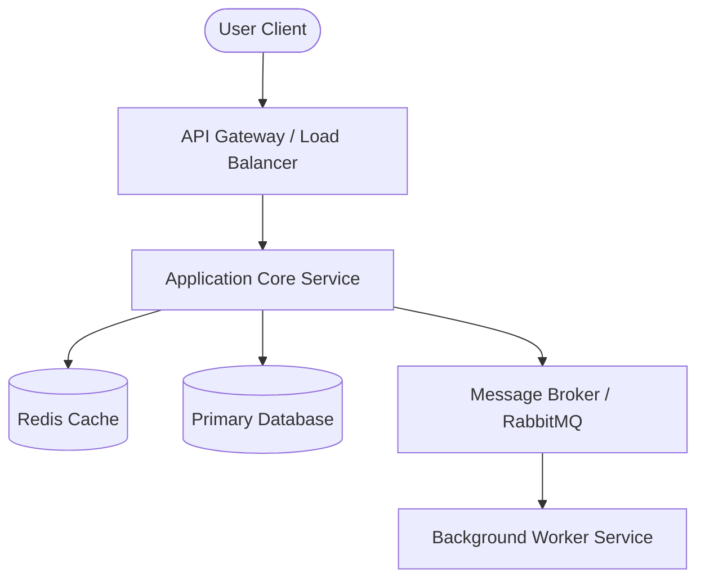
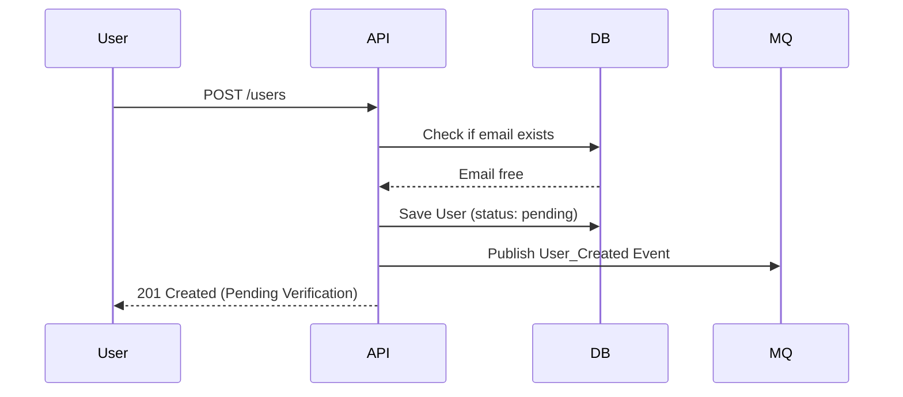

# Architecture & Design Document

This document outlines the architectural pattern, component structure, and design decisions of **[Project Name]**.

---

## 🧭 Architectural Overview

Provide a high-level summary of the architectural style used (e.g., Microservices, Monolithic, Event-Driven, Clean Architecture, Serverless).

### Core Design Goals
1. **Goal 1**: (e.g., Low latency data processing)
2. **Goal 2**: (e.g., High availability and horizontal scaling)
3. **Goal 3**: (e.g., Extensible plugin architecture)

---

## 🗺️ System Topology

Here is the high-level architecture diagram showing the relationship between clients, servers, and data stores:

---

## 📦 Component breakdown

Detailed descriptions of each primary subsystem or module.

### 1. API Gateway / Router
- **Responsibility**: Rate limiting, routing, SSL termination, and authentication validation.
- **Tech Stack**: e.g., Nginx, AWS API Gateway, or Traefik.

### 2. Application Core
- **Responsibility**: Business logic execution, domain logic, orchestration.
- **Data Flow**: Communicates synchronously with DB/Cache, and asynchronously via message queues.

### 3. Background Workers
- **Responsibility**: Heavy-lifting processing (e.g., generating PDFs, sending emails).

---

## 💾 Data Architecture

### Database Schema / Models
Explain the storage strategy. 
- **Primary Database**: PostgreSQL (Relational) - used for transactions and relational data.
- **Caching Layer**: Redis - used for session storage and database query caching.

### Data Flow Example (Create User Workflow)

---

## ⚡ Key Architectural Decisions (ADRs)

List major decisions that impact the architecture, using the following format:

### ADR-001: Choice of [Technology/Pattern]
- **Status**: [Proposed / Accepted / Rejected]
- **Context**: What problem were we trying to solve?
- **Decision**: What did we choose to do?
- **Consequences**: What are the trade-offs (positive/negative)?

---

## 🔒 Security & Compliance

- **Authentication**: JWT tokens, OAuth2, or session-based.
- **Data Protection**: Encryption at rest (AES-256) and in transit (TLS 1.3).
- **Access Control**: Role-Based Access Control (RBAC) enforced at controller levels.
